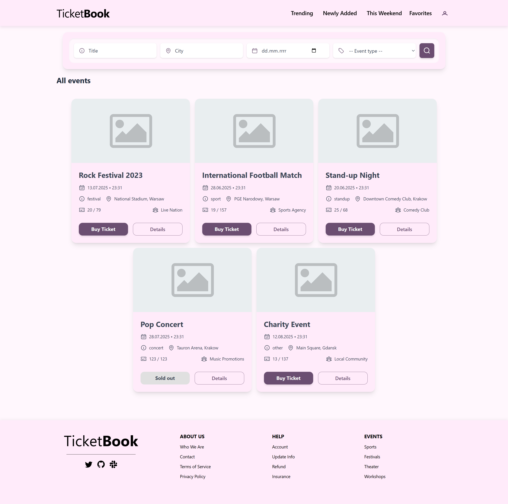
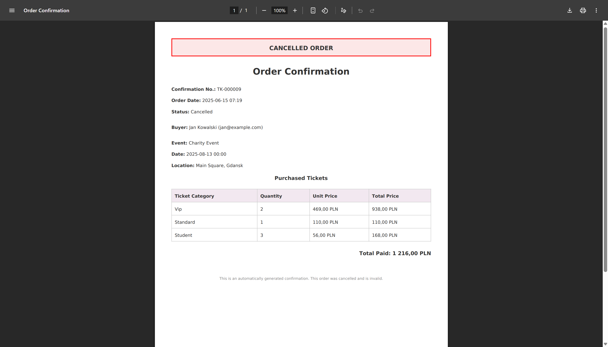
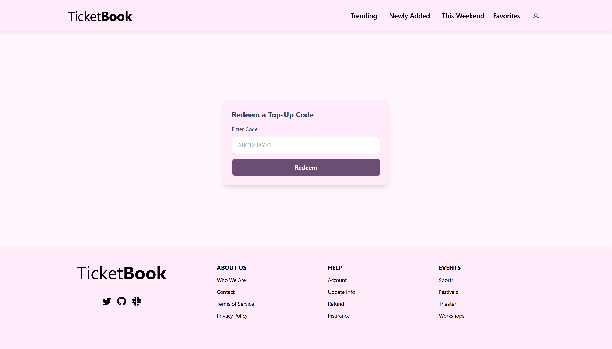
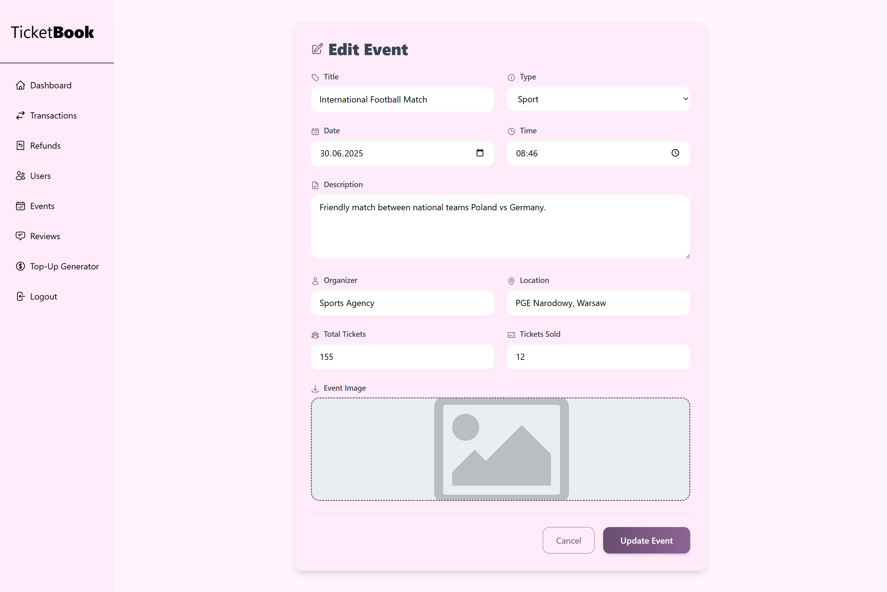

# Projekt AI1

[Repozytorium projektu](https://github.com/hubertfus/TicketBook)

[Tablica projektowa](https://github.com/users/hubertfus/projects/5)

---

### Temat projektu

Aplikacja stanowi intuicyjną platformę umożliwiającą użytkownikom szybkie i wygodne przeglądanie oraz kupowanie biletów na wydarzenia.

---

### Zespół E4

| Profil                                         | Rola            |
| ---------------------------------------------- | --------------- |
| [Hubett Fusiarz](https://github.com/hubertfus) | lider zespołu   |
| [Nadia Schiffer](https://github.com/gimroth)   | członek zespołu |
| [Dawid Skiba](https://github.com/4rompery)     | członek zespołu |
| [Emilia Szczęch](https://github.com/xmemxa)    | członek zespołu |

---

## Opis projektu

Aplikacja umożliwiająca użytkownikom szybkie i wygodne kupowanie biletów na wydarzenia

Aplikacja stanowi intuicyjną platformę, która pozwala użytkownikom w prosty sposób przeglądać i kupować bilety na różnorodne wydarzenia, takie jak koncerty, spektakle teatralne, wydarzenia sportowe czy festiwale. Dzięki przejrzystemu interfejsowi, użytkownicy mogą:

-   Rejestracja i logowanie użytkowników,
-   Możliwość wyszukiwania dostępnych wydarzeń według różnych kryteriów: data,
    miejsce, typ wydarzenia,
-   Filtry umożliwiające zawężenie wyników,
-   Wyświetlanie szczegółów wydarzenia, takich jak opis, data, godzina, lokalizacja,
-   Zakup biletów,
-   Monitorowanie dostępności biletów w czasie rzeczywistym,
-   Możliwość anulowania zakupu,
-   Obsługa zwrotów pieniędzy,
-   Możliwość dodawania ocen i recenzji przez użytkowników po odbyciu
    wydarzenia,

### Narzędzia i technologie

| Technologia                      | Wersja |
| -------------------------------- | ------ |
| **Laravel Framework**            | ^12.0  |
| **barryvdh/laravel-dompdf**      | ^3.1   |
| **blade-ui-kit/blade-heroicons** | ^2.6   |
| **blade-ui-kit/blade-icons**     | ^1.8   |
| **Vite**                         | ^6.2.4 |
| **Tailwind CSS**                 | ^4.0.0 |
| **Alpine.js**                    | 3.x.x  |
| **Swiper.js**                    | 9.x    |

## Uruchomienie aplikacji

### Wymagania wstępne

Aby uruchomić projekt lokalnie, należy mieć zainstalowane:

-   PHP (>= 8.2)
-   Composer
-   PostgreSQL (zalecana wersja 14 lub nowsza)
-   Node.js wraz z NPM
-   Laravel CLI (opcjonalnie)
-   Git

### Krok po kroku:

1. **Sklonuj repozytorium:**

```bash
git clone https://github.com/hubertfus/TicketBook.git
cd TicketBook
```

2. **Sprawdź, czy Composer i PostgreSQL są zainstalowane oraz dodane do zmiennych środowiskowych PATH.**

Skrypt `start.bat` samodzielnie weryfikuje obecność Composer oraz PostgreSQL w systemie.

3. **Uruchomienie skryptu startowego na systemie Windows:**

W katalogu głównym projektu uruchom plik start.bat (dwukrotnie klikając lub uruchamiając przez terminal):

```bash
start.bat
```

Skrypt automatycznie:

-   Sprawdza obecność Composer i PostgreSQL,
-   Uruchamia PostgreSQL (jeśli nie był uruchomiony),
-   Instaluje zależności PHP przez Composer,
-   Tworzy plik `.env` jeśli nie istnieje (kopiuje z `.env.example`),
-   Generuje klucz aplikacji Laravel (`php artisan key:generate`),
-   Wykonuje migracje bazy danych (`php artisan migrate`),
-   Wykonuje seedy bazy danych (`php artisan db:seed`),
-   Tworzy link do katalogu storage (`php artisan storage:link`),
-   Optymalizuje konfigurację, cache i widoki aplikacji,
-   Kopiuje plik placeholder dla obrazów,
-   Uruchamia backendową aplikację Laravel (`php artisan serve`),
-   Instaluje zależności frontendowe przez NPM,
-   Uruchamia frontendowy serwer deweloperski Vite (`npm run dev`).

4. **Ręczne uruchomienie (jeśli chcesz ręcznie odpalić aplikację):**

```bash
composer install
cp .env.example .env
php artisan key:generate
php artisan migrate --seed
php artisan storage:link
php artisan serve
npm install
npm run dev
```

5. **Domyślny adres aplikacji:**

```
http://127.0.0.1:8000
```

---

Przykładowi użytkownicy aplikacji:

-   administrator: admin@example.com password123
-   użytkownik: jan@example.com password123
-   użytkownik: user1@example.com password123

### Baza danych


## Widoki aplikacji


_Strona główna_


_Logowanie_


_Rejestracja_


_Przypominanie hasła_


_Przypominanie hasła alert_


_Przypominanie hasła alert_


_Widok wydarzeń dla użytkownika_


_Widok szczegółów wydarzenia_


_Widok transakcji użytkownika_


_Widok szczegółów transakcji użytkownika_


_Widok potwierdzenia zakupu_


_Widok danych użytkownika_


_Widok kodów top-up użytkownika_


_Widok kodów top-up użytkownika_


_Widok odbierania kodów top-up użytkownika_


_Widok zakupu biletu_


_Widok zatwierdzenia zakupu_


_Widok dashboardu admina_


_Widok transakcji admina_


_Widok zwrotów admina_


_Widok użytkowników admin_



_Widok użytkowników admin_


_Widok biletów admin_


_Widok komentarzy admin_


_Widok generowanie kodów top-up admin_
